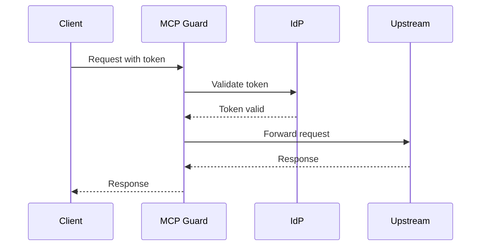

# Documentation Style Guide

Guidelines for writing MCP Guard documentation.

## Writing Style

### Voice and Tone

- **Active voice:** "Configure the JWT provider" not "The JWT provider should be configured"
- **Present tense:** "MCP Guard validates the token" not "MCP Guard will validate the token"
- **Direct address:** Address the reader as "you" not "the user"
- **Concise:** Get to the point. Avoid unnecessary words.
- **Professional:** Avoid slang, jokes, or overly casual language

### Examples

**Good:**

> To enable JWT authentication, add the `[auth.jwt]` section to your configuration file.

**Avoid:**

> If you want to use JWT authentication, you'll need to go ahead and add a section called `[auth.jwt]` to your configuration file.

---

## Document Structure

### Standard Sections

Most documentation should follow this structure:

1. **Title** - Clear, descriptive H1
2. **Introduction** - One or two sentences explaining the topic
3. **Prerequisites** (if applicable)
4. **Main content** - Step-by-step or conceptual
5. **Examples** - Complete, working examples
6. **Troubleshooting** - Common issues and solutions
7. **See Also** - Links to related documentation

### Headings

- **H1 (`#`):** Document title only (one per file)
- **H2 (`##`):** Major sections
- **H3 (`###`):** Subsections
- **H4 (`####`):** Avoid if possible; restructure content instead

Use title case for headings: "Quick Start Guide" not "Quick start guide"

---

## Formatting

### Code Blocks

Always specify the language for syntax highlighting:

````markdown
```toml
[auth.jwt]
mode = "jwks"
```
````

Use inline code for:
- File names: `mcp-guard.toml`
- Commands: `mcp-guard run`
- Configuration keys: `jwks_url`
- Values: `"RS256"`

### Lists

Use bulleted lists for:
- Unordered items
- Feature lists
- Options without sequence

Use numbered lists for:
- Step-by-step instructions
- Sequential processes
- Prioritized items

### Tables

Use tables for:
- Configuration options with multiple attributes
- Comparisons
- Reference data

**Example:**

| Field | Type | Default | Description |
|-------|------|---------|-------------|
| `enabled` | boolean | `true` | Enable the feature |
| `timeout` | integer | `30` | Timeout in seconds |

---

## Code Examples

### Requirements

All code examples must be:

1. **Complete:** Include all necessary configuration
2. **Runnable:** Work without modification (except placeholder values)
3. **Realistic:** Use sensible values, not "foo" or "bar"
4. **Commented:** Explain non-obvious parts

### Placeholder Values

Use consistent placeholders that are clearly identifiable:

| Type | Placeholder | Example |
|------|-------------|---------|
| Domain | `your-domain.com` | `https://your-domain.com` |
| Auth0 tenant | `your-tenant.auth0.com` | `https://your-tenant.auth0.com` |
| API key | `YOUR_API_KEY` | `Authorization: Bearer YOUR_API_KEY` |
| Secret | `your-secret-here` | `client_secret = "your-secret-here"` |
| Token | `YOUR_ACCESS_TOKEN` | `-H "Authorization: Bearer YOUR_ACCESS_TOKEN"` |

### Configuration Examples

Use TOML as the primary format. Include comments for clarity:

```toml
[auth.jwt]
mode = "jwks"
jwks_url = "https://your-tenant.auth0.com/.well-known/jwks.json"
algorithms = ["RS256"]
issuer = "https://your-tenant.auth0.com/"  # Include trailing slash
audience = "mcp-guard"
```

### Command Examples

Show both the command and expected output when helpful:

```bash
mcp-guard version
```

**Output:**

```
mcp-guard 1.0.0
Built: 2024-12-15
```

---

## Terminology

Use consistent terminology throughout documentation:

| Term | Usage |
|------|-------|
| MCP Guard | Product name (not "mcp-guard" in prose) |
| `mcp-guard` | CLI command or binary |
| Token | Generic authentication credential |
| API key | Specific auth type (not "api-key" or "API Key") |
| JWT | JSON Web Token (no periods) |
| OAuth | Not "Oauth" or "OAUTH" |
| IdP | Identity Provider (not "IDP" or "idp") |
| Upstream | The MCP server MCP Guard proxies to |

### Avoid

- "Simply" or "just" - implies something is easy when it may not be
- "Obviously" or "clearly" - can be condescending
- "etc." - be specific about what's included
- Undefined acronyms - define on first use

---

## Links and References

### Internal Links

Use relative paths for links within the documentation:

```markdown
See the [Authentication Guide](authentication.md) for details.
```

For subsections:

```markdown
See [JWT Authentication](authentication.md#jwt-authentication).
```

### External Links

Include descriptive text, not raw URLs:

**Good:**

```markdown
See the [Auth0 documentation](https://auth0.com/docs) for more information.
```

**Avoid:**

```markdown
See https://auth0.com/docs for more information.
```

### See Also Sections

End documents with related links:

```markdown
## See Also

- [Quick Start Guide](quickstart.md) - Get started in 5 minutes
- [Configuration Reference](configuration.md) - Complete configuration options
- [Troubleshooting Guide](troubleshooting.md) - Common issues and solutions
```

---

## Diagrams

### When to Use Diagrams

Use diagrams for:
- Architecture overviews
- Request flows
- Complex relationships

### ASCII Diagrams

Prefer ASCII diagrams for simple flows:

```
Client → MCP Guard → Upstream Server
           ↓
        Auth Check
           ↓
       Rate Limit
```

### Mermaid Diagrams

For more complex diagrams, use Mermaid (renders on GitHub):

````markdown

````

---

## Common Patterns

### Prerequisites Section

```markdown
## Prerequisites

- MCP Guard installed ([installation guide](quickstart.md#installation))
- Auth0 account ([sign up free](https://auth0.com))
- Basic familiarity with JWT authentication
```

### Step-by-Step Instructions

```markdown
## Step 1: Create Configuration

1. Run the init command:
   ```bash
   mcp-guard init
   ```

2. Open the generated file:
   ```bash
   cat mcp-guard.toml
   ```

3. Modify the configuration as needed
```

### Troubleshooting Section

```markdown
## Troubleshooting

### "Error message here"

1. Check this first
2. Then try this
3. If that doesn't work, verify this

### Another common error

Explanation of why this happens and how to fix it.
```

---

## Review Checklist

Before submitting documentation:

- [ ] Spell check completed
- [ ] All code examples tested and working
- [ ] Links verified (internal and external)
- [ ] Terminology is consistent
- [ ] No undefined acronyms
- [ ] Step-by-step instructions are numbered
- [ ] Troubleshooting section included (where applicable)
- [ ] See Also section with relevant links
